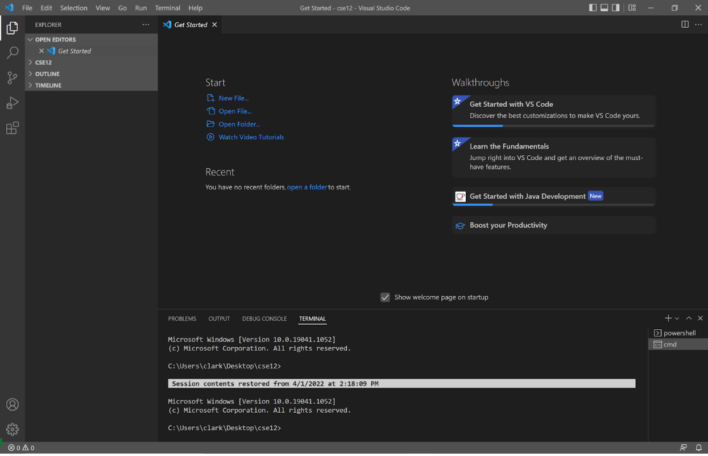
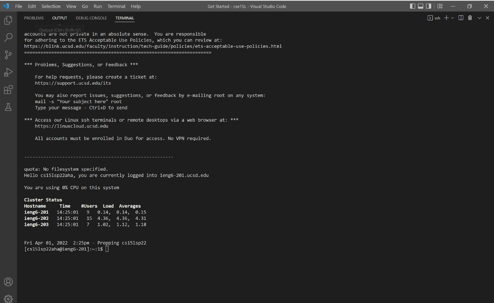
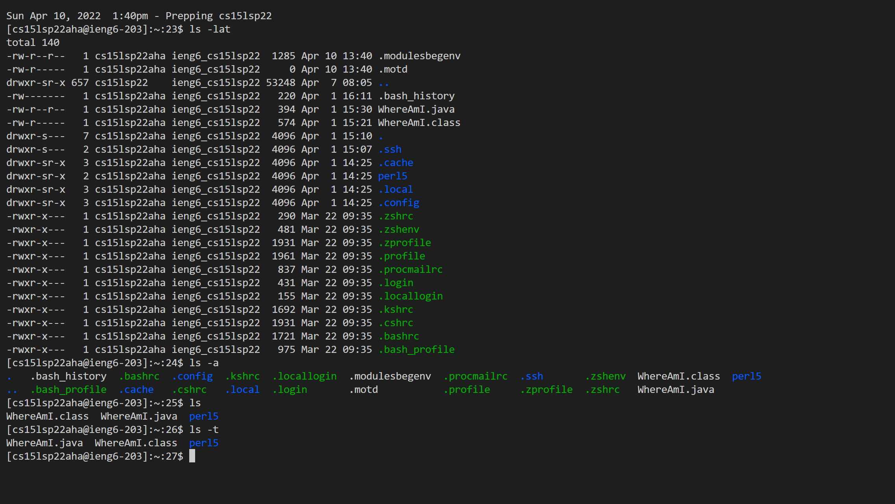
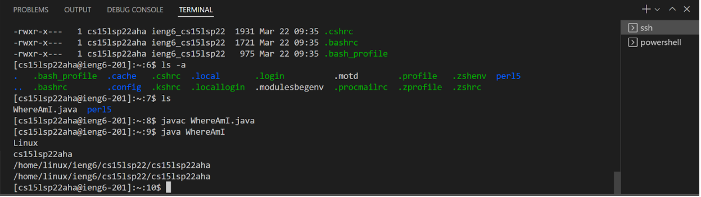
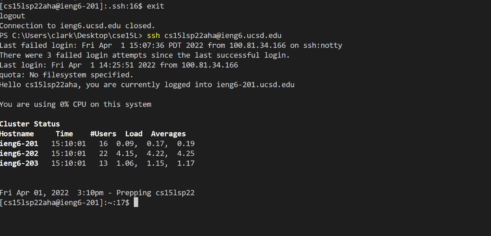
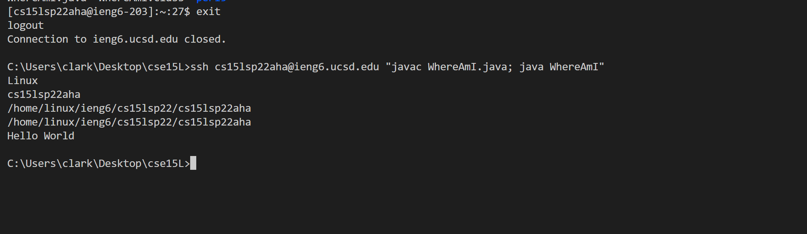

## Lab 1
---
 **Setting up VScode**

    In order to first set up VScode, we need to install the appropriate version from the official website. Since I am on a Windows laptop, I installed the latest version for Windows x64 where the application will install and require no further modication to the installer to work properly. My VScode looked relatively similar to all my other group members with the exception of slight theme differences.

---
**Remotely Connecting VIA SSH**

    With the use of VScode, I opened a new terminal where I inputted a SSH command followed by my course-specific login information. After correctly typing in my username and password, I am then asked to verify my connection by typing "Yes" into the terminal in which the terminal will greet me on a successful login. Compared to other lab users, my login screen looked almost exactly the same, apart from differences in usernames and the current user count at the time. The difference in current user count only varied due to the influx of students performing remote connections throughout the lab.

---
**Testing SSH Commands**

    After a successful remote connection with SSH, we tried various commands on the terminal that did different things from simply listing directories, to moving directories, creating directories, or combining multiple commands altogether. One important command to note is "ls" which lists all files in the current working directory on the terminal. The "ls" command has several different variations such as "ls -a", "ls -lat", and several more which may either display a wider range of directories or only display specified ones. Another notable command is "cd" which changs the user directory to whatever directory they input, which is useful to know in order to navigate around different directories when working with many files. One more command worth noting is "mkdir" which is shorthand for "make directory" which is useful in order to make more directories with a user-inputted name.

---
**Moving Files over SSH with SCP**

    Now after having some first hand experience with using commands, I created a JAVA file on VScode called "WhereAmI". In this file, I wrote several "System.getProperty" statements that would print out different user information ranging from OS name, username, and user directory. After compiling and running the code to confirm that it works, I ran a code on a separate terminal apart from the SSH running the remote connection. On this separate terminal which is my client, I entered a "scp" or "secure copy" command with the files name and my remote username. After this step, I transitioned back into the remote client where I was able to compile and run this JAVA file. 

    When I ran this code on my client terminal, it printed out my laptop's current OS and user information including my name. On the otherhand, when I run this code on the remote computer, it prints out a different OS and instead of my client computer's name, it will print out my remote login information. Due to the difference between the client output and the remote output, "System.getProperty" is shown to get information from the current machine that the command is ran on. When I repeated this process of editing a JAVA file and sending it to my remote connection, it took me about 2 minutes to copy over, but I believe with more practice I think I can do it faster.

---
**SSH Keys**

    In order to speed up my login process and verifcation process of certain commands, I generated a SSH key on my client terminal with the "ssh key-gen" command. After selecting the directory that I wanted to store it in, terminal outputs a randomart for the key. With this key generated, I went back to the remote terminal and entered the "mkdir .ssh" command in order to make the ".ssh" directory. Back on the client terminal, I typed in the file name of the key and my remote login to copy over the key. After a successful copy of the key has been sent, I logged out of my remote connection and logged back in without needing to type in my password which will save me a lot of time over repeated logins.

---
**Making Remote Running Even More Pleasant**

    In this section of the lab I tried to make the act of editing a file on my client terminal, copying this file, and running it on my remote terminal in the most efficient way possible. Through some trial and error, I learned that I can combine several commands to act in succession to speed up the process. First on my local machine, I used the "scp" command to send a copy to my remote terminal. If I am not logged into my remote account, I enter the "ssh" command followed by a "javac and java command" which will run the file upon my login. Overall, this process took about two lines of code to complete.

