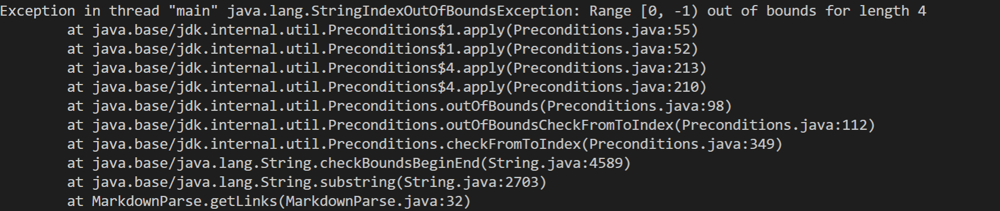
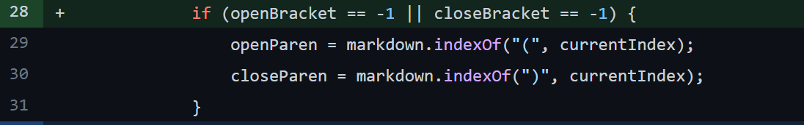
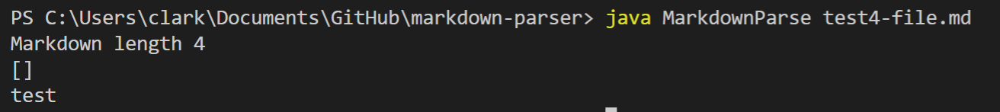
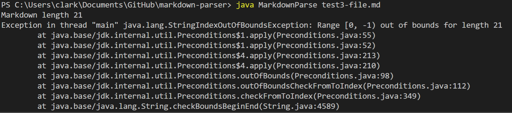
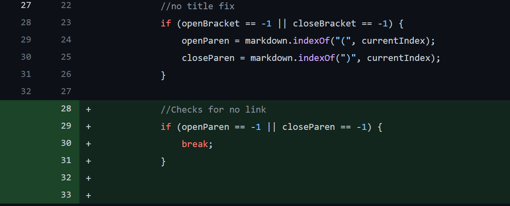
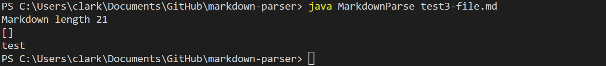
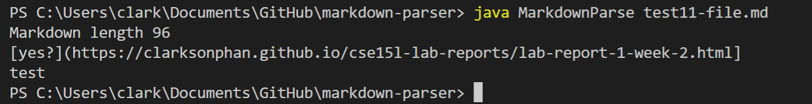
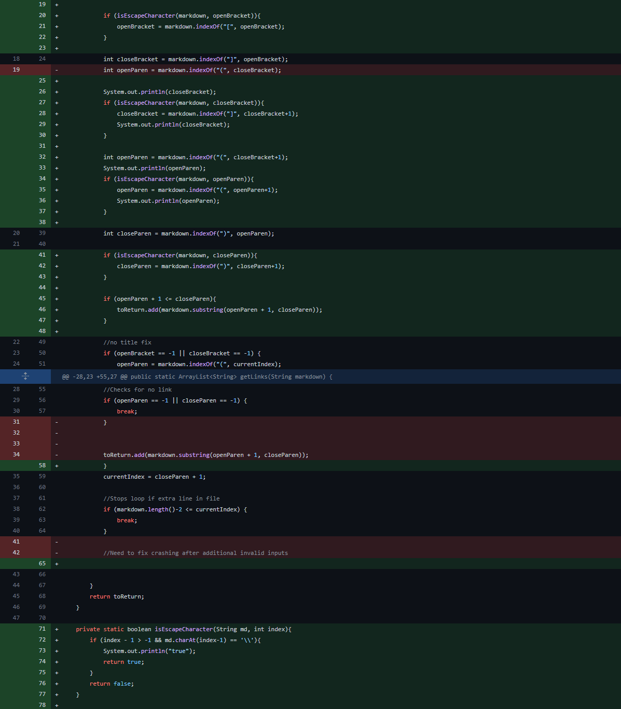
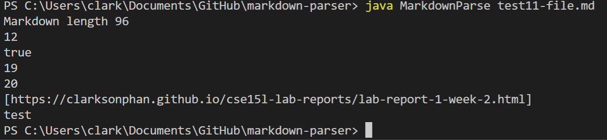

# Lab Report 2

## Finding a Failure-Inducing Input

---
 - **First Bug**

    In the [fourth test file](https://raw.githubusercontent.com/clarksonphan/markdown-parser/main/test4-file.md), there are three empty lines with no title present for a link. When we run the code to test this file, it results in an index out of bounds exception. This symptom is most likely caused by a bug from the code which tries to find the index of a completely empty file. This attempt access of the file's index led to an index exception in the terminal which is the symptom.

    

    In order to fix this bug, a conditional statement was added after the parsing loop to check for an empty input within the title brackets. This conditional will then return an empty bracket if no title is present rather than trying to access an empty file.

    

    An example of the correct output is shown below:
    
---
- **Second Bug**

    The second issues appears when testing [file 3](https://raw.githubusercontent.com/clarksonphan/markdown-parser/main/test3-file.md) in which there is a title with no following link. The symptom when running this file is similar to the title, where an index exception will occur. The bug with this link problem is very similar to the title problem in which the program is trying to access an index between parentheses that do not exist. This will result in an attempted access to an index which does not exist which is why the terminal will throw an exception.

    

    To fix this bug, the solution will be very similar to the title solution which will include the addition of a conditonal statement. In this conditional statement, it will check to see if a link exists between the two parentheses or not. If a link does not exist, it will break out of searching for the current link.
    
    

    An example of the correct output is shown below:

    
---
- **Third bug**
    
    The third issue appears when we test [file 11](https://raw.githubusercontent.com/clarksonphan/markdown-parser/main/test11-file.md) where the code outputs the title alongside the link. This occurs when we add random symbols such as question marks and slashes into the title. The problem stems from a bug where the code does not know how to recognize anything other than parentheses or brackets so in turn, it will confuse it for parts of the link.

    

    In order to resolve this error, a new method is created to check for invalid symbols such as slashes. If this method finds a slash within the parts of the link and title which have been parsed, it will ignore them. 

    

    Below is a picture of the correct output after these changes:

    

    

