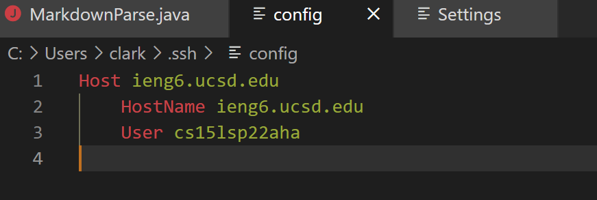
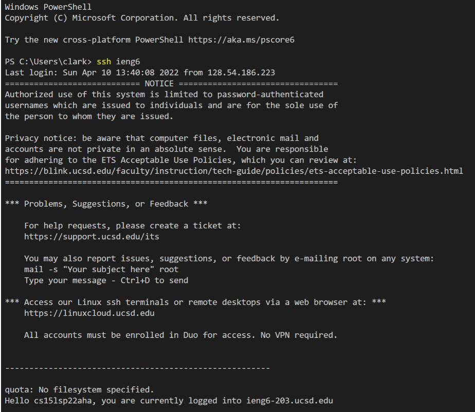
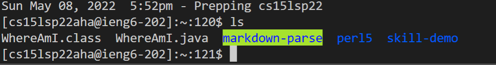
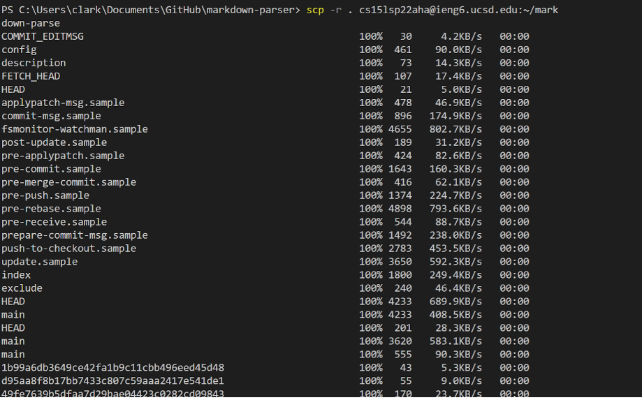
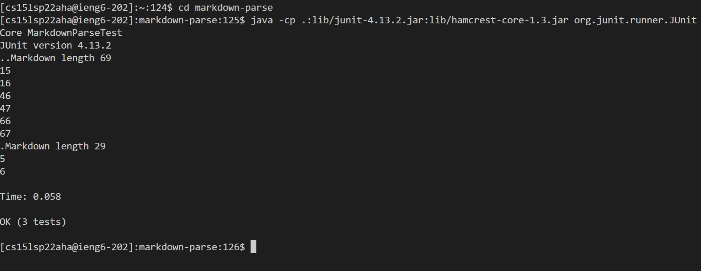
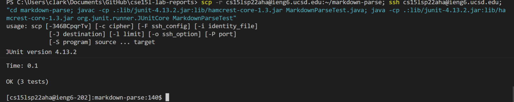

# Lab Report 3

- **Streamlining ssh Configuration**
    
    To log onto the remote server, I typically have to type the `ssh` command alongside all my login information such as my username and password. In this part of the lab, I altered a config file to include the remote server's hostname and my own username to speed up the login process.

    
    This is the config folder that I edited on VScode with the connection information.

    

    Below is a successful ssh login with the configuration.

    

    This is the file listing of a successful copy using scp.

    
---
- **Setup Github Access from ieng6**

    fafa

---
- **Copy whole directories with `scp -r`**

    With the `scp -r` command we are able to copy whole directories with one command rather than using the scp command to copy singular files. 

    

    This is my test running successful from the remote repository.

    

    In this line, several commands are combined in order to copy and run the tests.

    