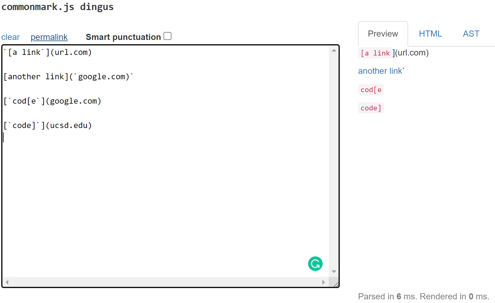
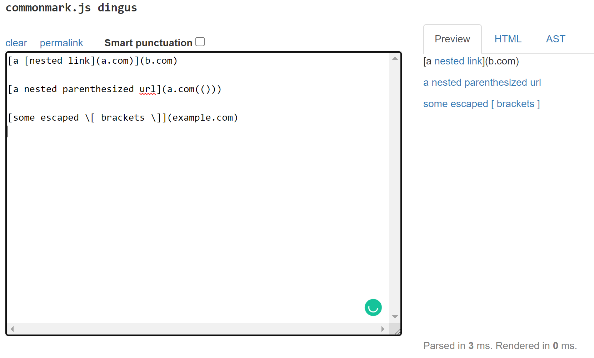
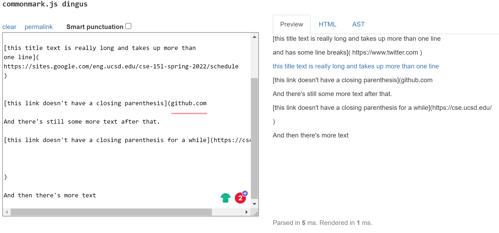
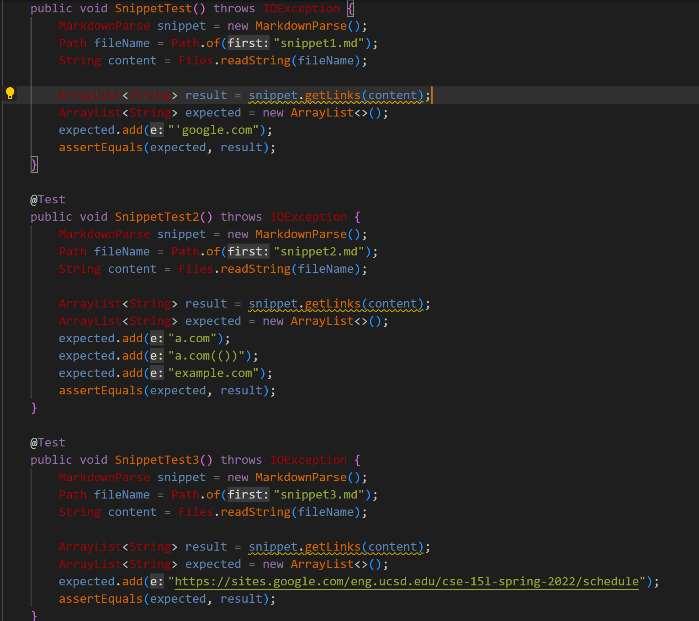
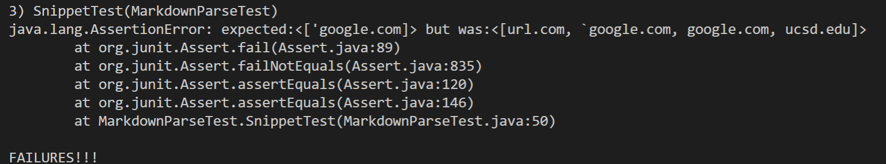
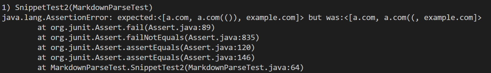
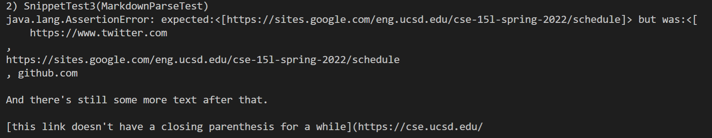
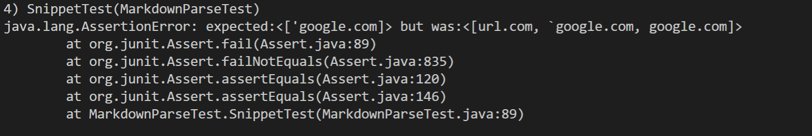
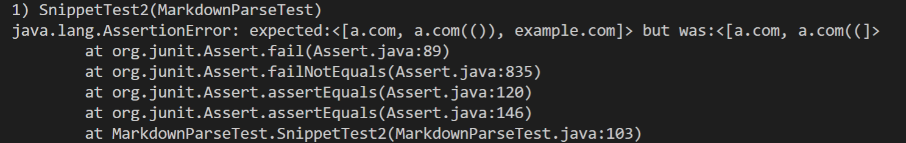
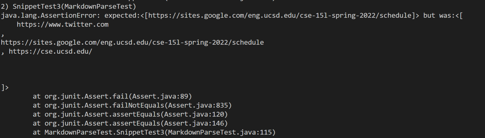

# Lab Report 4

- **Links to Markdown Repositories**

    My implementation: [https://github.com/clarksonphan/markdown-parser](https://github.com/clarksonphan/markdown-parser)

    Reviewed implementation: [https://github.com/katieki/markdown-parser](https://github.com/katieki/markdown-parser)
---

- **Commonmark Output Preview**

    **Snippet 1:**
    
    The expected output for this snippet should be ['google.com].
    
    **Snippet 2:**
    
    The expected output for this snippet should be [a.com, a.com(()), example.com].

    **Snippet 3:**
    
    The expected output for this snippet should be [https://sites.google.com/eng.ucsd.edu/cse-15l-spring-2022/schedule].

---
- **Writing Tests**

    These are the test methods that will be used to test the three snippets.

    

---
- **Test Results for my Implementation**

    The test case for snippet 1 did not match the expected result. The output had more links than expected.
    

    The test case for snippet 2 also failed to match the expected result. The output had an incorrect amount of parentheses for the second link.
    

    The test case for snippet 3 also failed to match the expected output. There was additional text in the output which was not expected.
    
    
---
- **Test Results for Reviewed Implementation**

    The first test case for snippet 1 on the reviewed implementation also failed. Similar to my own implementation, it also had extra links, but it had one less link than my own implementation.

    

    The second test for snippet 2 on the reviewed implementation failed. In this instance, it left out one link that was expected.
    

    The last test for snippet 3 on the reviewed implementation also failed. Compared to mine, it took out more of the excess text; however, the format for the link was not correct.
    
---
- **Reworking my Code**

    **Troubleshooting Snippet 1**
    
    In order to fix the issue in 10 lines or less with backticks in MarkdownParse, I believe that the indexOf method could be used to identify backtick characters in the given file. In this method, we will add extra code to simply ignore or leave out backticks when reading the file. For the issue with extra brackets, that would involve a counter to keep track of both closing and opening brackets. If the number is not equal, then the link will be skipped.
    
    **Troubleshooting Snippet 2**
    
    To fix the problem with nested parentheses, brackets, and escape brackets shown in the second snippet in 10 lines or less, it would involve the same solution as snippet 1. I would need to implement variables to keep track of these brackets or parentheses and compare if they equal eachother by the end of the file reading. If the variables do not equal eachother, the link should not be in the output.

    **Troubleshooting Snippet 3**

    In order to address the problem with newlines between brackets and parentheses in 10 lines or less, we might have to add a helper method to check for empty lines between the opening and close parentheses. We would then have to call upon this helper method when reviewing files to check for these lines and get rid of additional ones. 

    
