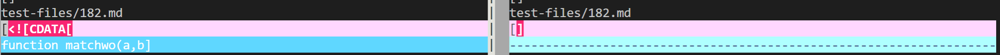

# Lab Report 5

- **Using vimdiff to Find Differences**

    In order to find the differences between the result files we must use the vimdiff command with the two different file paths to compare.

    

    In this lab report, I will focus on resolving the bugs with test files 182 and 194.
---
- **First Difference: Test 182**

    Test case link: [https://github.com/nidhidhamnani/markdown-parser/blob/main/test-files/182.md](https://github.com/nidhidhamnani/markdown-parser/blob/main/test-files/182.md)

    
    

    Although the commonmark website states that the output should be "okay", in terms of the markdown parser the correct output is actually the one shown on the right with the empty brackets. This is due to the fact that the markdown parser should be able to sort out inputs with closing and opening brackets and even closing and opening parentheses. 

    In order to fix my code I would most likely have to fix the while-loop of the getLinks method. As seen in the picture below, I would have to add an additional if-statement to check for either an input with no parentheses or an input with nothing between parentheses. This will help sort out empty links and even invalid inputs such as strings with no closing or opening parameters.

    
---
- **Second Difference: Test 194**

    Test case link: [https://github.com/nidhidhamnani/markdown-parser/blob/main/test-files/194.md](https://github.com/nidhidhamnani/markdown-parser/blob/main/test-files/194.md)

    
    

    In terms of test file 194, my markdown parse created one large bracket with several difference URLs inside. As seen in the expected output, a link should not even be created for the input. In order to fix this issue, I would once again need to fix and add conditions within the getLinks while-loop.
    
    I would need to an if-statement and maybe even several if-statements to check for closing and starting parentheses or brackets. This would help solve the initial problem of this file not having an opening bracket. In terms of the missing parentheses, the solution would involve adding another if-statement to check for that too.

    As seen in the picture below, additional if-statements can be used between these other statements to check for invalid closing or opening parameters.

    

